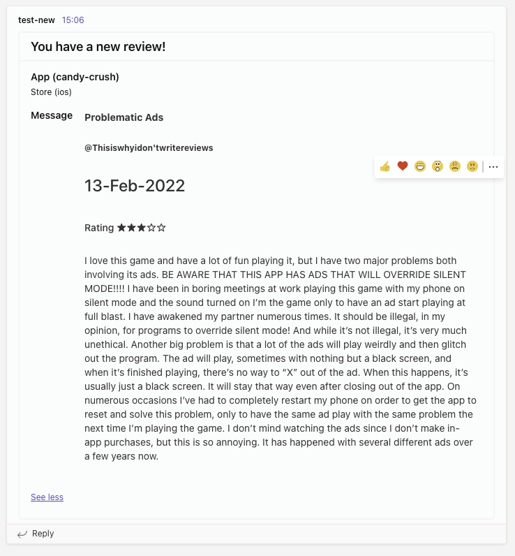
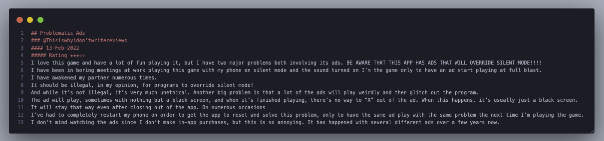
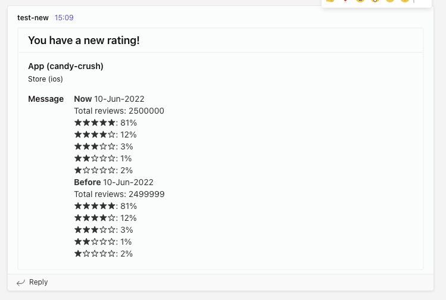
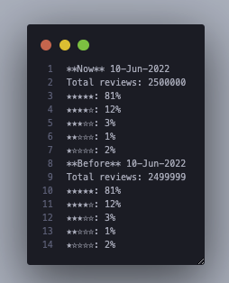

<h1 align="center">Apple App Store Reviews API & Notifier.</h1>

<p align="center">
  Monitor your app store reviews and get notified when new reviews are published.
  <br>
  Apple app store reviews command line API for iOS Apps.
  <br>
  Written in Go :heart:

</p>

**Blazing Fast:**

**Command line:** Arch free binary to run as scheduler on any platform.

**Proxy support:** Works behind a proxy.

**Notifications:** Supports multiple notification channels Microsoft Teams or console output.

**Dependencies:** Works with sqlite on disk or in memory.

### Notification sample on new review


<h3 align="center">
    Microsoft Teams
</h3>

<p align="center">
  
</p>

<h3 align="center">
   Terminal
</h3>

<p align="center">
  
</p>

### Notification sample on new rating

<h3 align="center">
    Microsoft Teams
</h3>

<p align="center">
  
</p>

<h3 align="center">
   Terminal
</h3>

<p align="center">
  
</p>


## Installation

```sh
go install github.com/kevincobain2000/go-app-reviews-scraper@latest
```

### From Command Line:

```sh
cp .env.local .env
go-app-reviews-scraper -migrate
ENV_PATH=./.env go-app-reviews-scraper -store="ios" -app-name="candy-crush" -reviews-url="https://apps.apple.com/us/app/candy-crush-saga/id553834731?see-all=reviews"
```

--

### Command Line Params Help:

```sh
go-app-reviews-scraper -h
  -app-name string
    	Description: Give a unique app name. Example: candy-crush
  -migrate
    	Description: Run DB migration
  -reviews-url string
    	Description: Link to all reviews page. Example: https://apps.apple.com/us/app/candy-crush-saga/id553834731?see-all=reviews
  -store string
    	Description: ios|android. Example: ios (default "ios")
```

### CHANGE LOG

- v1.0 - Initial release includes iOS App store reviews scraper and notification to MS Teams.

### ROADMAP

- v1.1 - Work in progress. Send notification via Email.
- v1.2 - Work in progress. Send notification via Slack.
- v2.0 - Google Play store support.
